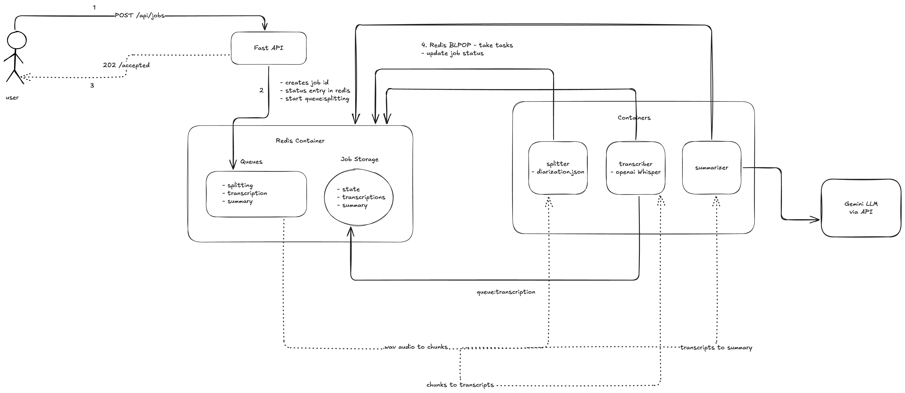

# Polygraf Meeting Summarizer

> A scalable, asynchronous Python backend that turns long meeting recordings into accurate transcripts and concise, AI-generated summaries.

> This system is built on a distributed, queue-based architecture using Redis and Docker. It can process large audio/video files in the background without blocking the user, providing a job ID to track progress and retrieve the final results.

[](https://fastapi.tiangolo.com/)
[](https://redis.io/)
[](https://docs.docker.com/compose/)
[](https://github.com/openai/whisper)
[](https://ai.google.dev/)

---

## What it does

- Accepts **mp4/wav** meeting recordings + a **speaker diarization JSON**
- Splits audio into chunks, **transcribes** with Whisper, and **summarizes** via Google Gemini
- Scales horizontally with **multiple workers** coordinated by **Redis queues**
- Provides **non-blocking** API: submit a job, **poll by `job_id`**, retrieve results when done

---

## Core Principle

- **The API does no heavy work** — it only accepts jobs and reports status.
- **Redis** is the central hub for queues, job state, and results.
- **Workers** do the compute (splitting → transcription → summarization) asynchronously.

---

## 🏗️ System Architecture



**Pipeline (3 Workers via Redis):**

1. **Worker A – Splitter**
   - Extracts audio from video (if needed)
   - Reads diarization JSON and splits the audio into **N** chunks
   - Enqueues **N** transcription tasks

2. **Worker B – Transcriber**
   - Processes each chunk from the transcription queue
   - Runs **Whisper** to produce text
   - Appends text fragments to Redis and increments `processed_chunks`
   - On last chunk, enqueues a final **summary** task

3. **Worker C – Summarizer**
   - Fetches all transcript fragments
   - Formats prompt + calls **Google Gemini**
   - Stores the final JSON summary in Redis and marks the job **complete**

---

## 🧰 Tech Stack

- **API**: FastAPI (Uvicorn)
- **Queues & State**: Redis
- **Transcription**: OpenAI Whisper
- **Summarization**: Google Gemini
- **Media I/O**: pydub, MoviePy
- **Containerization**: Docker & Docker Compose

> Compose services: `redis`, `api`, `worker-splitter`, `worker-transcriber`, `worker-summarizer`.

---

## 📁 Project Layout (high-level)
```
.
├── app/
│   ├── main.py                 # FastAPI app (routes: /jobs, /jobs/{job_id})
│   ├── routes/
│   │   ├── jobs.py
│   ├── services/
│   │   ├── audio_extractor.py
│   │   ├── consumer.py
│   │   ├── redis_service.py
│   │   ├── transcriber.py
│   ├── workers/
│   │   ├── splitter.py
│   │   ├── transcriber.py
│   │   └── summarizer.py
├── data/                       # Create this folder in root            
│   ├── audio.wav               # Add your audio.wav 
│   ├── diarization.json        # Add your diarization.json
├── logs/
├── architecture.png            # Architecture diagram (shown above)
├── docker-compose.yaml         # Multi-service definition
├── .env.example                # Example environment file (see below)
└── README.md
```

---

## Requirements

- **Docker Desktop** (or Docker Engine + Compose)
- **API keys** for **Google Gemini**
- Sufficient CPU/GPU for Whisper (CPU works; GPU recommended for large files)

---

## Environment Setup

Create a `.env` file at the repo root:

```env
# -- App Config --
APP_ENV=development

# -- API Keys (Required) --
GEMINI_API_KEY=AIzaSy...                # Required
GENAI_MODEL=gemini-2.5-flash

LOG_LEVEL=INFO
API_PORT=8000
WHISPER_MODEL=base
```
---

## Docker
```
# Build images and start all services
docker compose up --build -d

# View logs
docker compose logs -f

# View all servicers
docker compose ps

# Stop and remove container
docker compose down

# Delete docker images
docker compose down --volumes --rmi all   

#Reclaim storage
docker system prune -a
```

## API Endpoints

- Colletion: <https://grey-moon-445797.postman.co/workspace/Manish~283d32b7-e13d-4cd5-a9d8-96c6fb685e4b/collection/17079845-59e50f92-a031-432a-9313-b023d340143a?action=share&creator=17079845>

## Final Output
```
{
    "job_id": "a7ad1243-755c-43eb-a536-7db75d4b5a37",
    "status": "complete",
    "summary": {
        "keypoints": [
            "The discussion focused on designing a service to protect backend systems from sudden request surges.",
            "A core goal is to prevent a single heavy user from consuming all resources and impacting others.",
            "The specific requirement is to limit a client to 100 requests per minute.",
            "The rate limiter logic would be placed in an API gateway or a dedicated service to act as a shield for the main application.",
            "The sliding window counter algorithm was chosen for implementing the rate limiter.",
            "Other rate limiting algorithms like fixed window and sliding window were also mentioned."
        ],
        "decisions": [
            "The rate limiter will be placed in an API gateway or a dedicated service.",
            "The sliding window counter algorithm will be used for rate limiting implementation."
        ],
        "action_items": [],
        "per_speaker_summary": {
            "Manish Reddy": "Explained the importance of preventing resource monopolization, proposed placing rate limiting logic in an API gateway or dedicated service to shield the main application, and chose the sliding window counter algorithm for implementation.",
            "Interviewer": "Initiated a discussion on designing services to protect backends from request surges, specified the requirement to limit client requests, and inquired about the architectural placement and implementation algorithms for rate limiting."
        }
    },
    "per_person": {
        "Manish Reddy": [
            "you",
            "you",
            "you you",
            "you",
            "What are your core goals that you want to try to achieve here? Thanks for the introduction.",
            "achieve here. Thanks for the introduction.",
            "Thanks for the introduction.",
            "So this fineness ensures that one heavy user doesn't consume all the resources and impacting the others.",
            "all the resources and impacting the others.",
            "Okay, that's a good one. So let's assume the requirements issue limit a client to 100 requests per minute. So what architecture layer would",
            "client to 100 requests per minute. So what architecture layer would",
            "place this logic in and why? Can you briefly explain that one?",
            "So, I would place the red limiter in a API gateway or maybe in a dedicated X service. So, this acts as a shield if we put it in an application logic.",
            "I would place the red limiter in a API gateway or maybe in a dedicated it service. So this acts as a shield if we put it in an application logic.",
            "So this acts as a shield if we put it in a application logic.",
            "our main application. That makes sense. Now let's talk about the implementation. There are several algorithms.",
            "That makes sense. So now let's talk about the implementation. So there are several algorithms.",
            "There are several algorithms.",
            "and why. The common ones are like most usually are they like a fixed window, sliding window and sliding window counter. I would select the sliding window counter algorithm.",
            "The common ones are like most usually, or like a fixed window, sliding window and sliding window counter. I would select the sliding window counter algorithm.",
            "of its window, sliding window and sliding window counter. I would select the sliding window counter algorithm.",
            "augment our content algorithm Do",
            "by the fixed window"
        ],
        "Interviewer": [
            "Hi, Manish. So welcome. Today let's discuss a pair of business. How do you approach design?",
            "So welcome today let's discuss a pair of business. How do you approach design?",
            "How do you approach design?",
            "service. So we want to protect our pack and services from being overhead by a sudden surge in request. Either that those can be malicious or",
            "from being overhead by a sudden surge in requests. Either that, those can be malicious or...",
            "request. Either that those can be malicious or I",
            "and closing the connections or routing to the application. So which defeats the major purpose of here what we are trying to do.",
            "purpose of here what we are trying to do.",
            "say that or fix a window counter."
        ]
    },
    "speakers": [
        "Manish Reddy",
        "Interviewer"
    ],
    "counts": {
        "Manish Reddy": 23,
        "Interviewer": 9
    }
}
```

## Limitations

- Input must be .wav: Only .wav audio files are processed.
- No .mp4 Support: Video processing is intentionally disabled.
- Reason: Extracting audio from video live caused extreme CPU load and instability.
- Your Job: You must extract the .wav from your video before calling the API.

## Disclaimer
- High Resource Use: Don't run this on a standard Windows laptop.
- Huge Docker Images: The stack is massive (FFMPEG, PyTorch, Whisper).
- My personal laptop actually died while running this.
